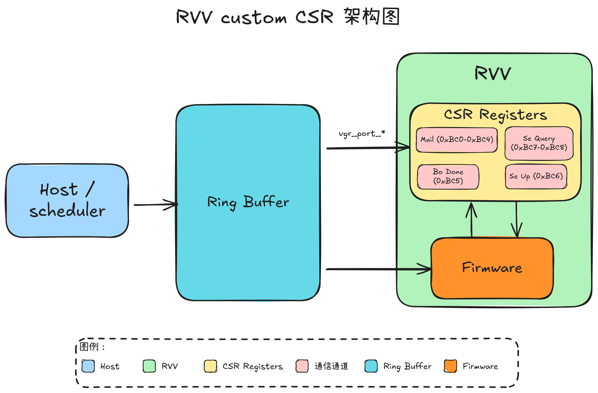

# RVV custom csr 设计文档

## 架构设计

### CSR 寄存器总览

RVV 通过 CSR 寄存器实现 mailbox 、bo 和 semaphore query/up 操作。以下是完整的寄存器映射表：

| CSR 地址 | 通道 | 寄存器名称 | 位宽 | 功能描述 |
|---------|------|-----------|------|---------|
| 0xBC0 | Mail | MAIL_DATA0 | 64bit | Mail 数据寄存器 0 |
| 0xBC1 | Mail | MAIL_DATA1 | 64bit | Mail 数据寄存器 1 |
| 0xBC2 | Mail | MAIL_DATA2 | 64bit | Mail 数据寄存器 2 |
| 0xBC3 | Mail | MAIL_DATA3 | 64bit | Mail 数据寄存器 3 |
| 0xBC4 | Mail | MAIL_VALID | 1bit | Mail 有效状态标志 |
| 0xBC5 | Bo done | BO_DONE | 11bit | 完成信号（5bit wg_index + 6bit bar_index） |
| 0xBC6 | Se up | SE_UP | 11bit | 更新信号（5bit wg_index + 6bit bar_index） |
| 0xBC7 | Se query | SE_QUERY_LOCK | 11bit | 查询锁信号（5bit wg_index + 6bit bar_index） |
| 0xBC8 | Se query | SE_QUERY_COUNT | - | 查询计数寄存器 |

### 接口信号

| 信号名称 | 方向 | 位宽 | 所属通道 | 功能描述 |
|---------|------|------|---------|---------|
| vgr_port__wdata | input | 32bit | Mail | 数据输入 |
| vgr_port__addr | input | 32bit | Mail | 地址/寄存器选择 |
| vgr_port__valid | input | 1bit | Mail | 有效信号 |
| vpu_no_busy | output | 1bit | - | VPU 忙碌状态 |
| se_query_lock | output | 1bit | Se query | 查询锁信号 |
| se_query_wg_index | output | 5bit | Se query | 工作组索引 |
| se_query_bar_index | output | 5bit | Se query | 屏障索引 |
| se_query_notify | input | 1bit | Se query | 查询通知信号 |
| se_up_wg_index | output | 5bit | Se up | 工作组索引 |
| se_up_bar_index | output | 6bit | Se up | 屏障索引 |
| se_up_done | output | 1bit | Se up | 更新完成信号 |
| bo_wg_index | output | 5bit | Bo done | 工作组索引 |
| bo_bar_index | output | 6bit | Bo done | 屏障索引 |
| bo_done | output | 1bit | Bo done | 完成信号 |

### Mail 通道详细说明

Mail 通道用于通过 scheduler ring buffer 发送邮件，最大支持 256bit 数据。

**数据传输流程：**
1. 主机写入 4 个 64bit 数据到 CSR 0xBC0-0xBC3
2. 主机写入 CSR 0xBC4 置位 mail valid，通知 RVV 获取 mail
3. RVV 通过轮询 CSR 0xBC4 查询 mail 状态
4. 当 valid 为高时，RVV 依次读取 CSR 0xBC0-0xBC3 获取 256bit 数据
5. 读取完成后，RVV 写入 CSR 0xBC4 清除 valid

**vgr_port__addr 地址映射：**
| Addr | 数据内容 | 位宽 |
|-----|---------|------|
| 0 | data0[31:0] | 32bit |
| 1 | data0[63:32] | 32bit |
| 2 | data1[31:0] | 32bit |
| 3 | data1[63:32] | 32bit |
| 4 | data2[31:0] | 32bit |
| 5 | data2[63:32] | 32bit |
| 6 | data3[31:0] | 32bit |
| 7 | data3[63:32] | 32bit |
| 8 | mail_valid | 1bit |

### Se query 通道详细说明

Se query 通道用于查询操作的同步机制。

**操作流程：**
1. RVV 写入 CSR 0xBC7，data[5:0]=bar_index，data[10:6]=wg_index，发送 lock pulse
2. 同时将 query_cnt 清零
3. 每次收到 notify pulse，query_cnt 加 1
4. RVV 查询 CSR 0xBC8，如果大于 0 表示上游有信号发送
5. RVV 写入 CSR 0xBC8 对 query_cnt 做减法操作（减少值不能大于查询得到的值）

### Se up 通道详细说明

Se up 通道用于更新操作。

**操作方式：**
- RVV 写入 CSR 0xBC6，data[5:0]=bar_index，data[10:6]=wg_index，发送 se_up_done

### Bo done 通道详细说明

Bo done 通道用于完成信号通知。

**操作方式：**
- RVV 写入 CSR 0xBC5，data[5:0]=bar_index，data[10:6]=wg_index，发送 bo_done

